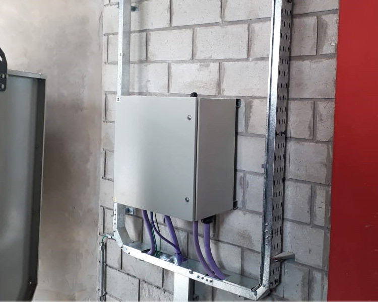
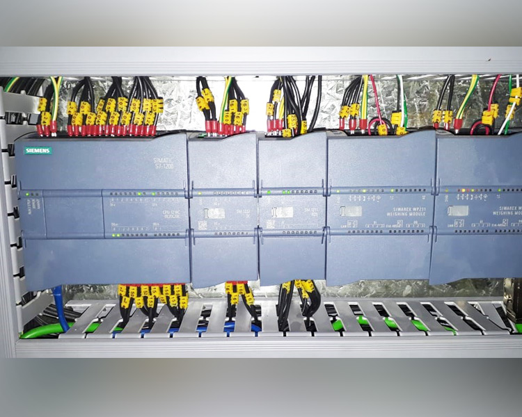
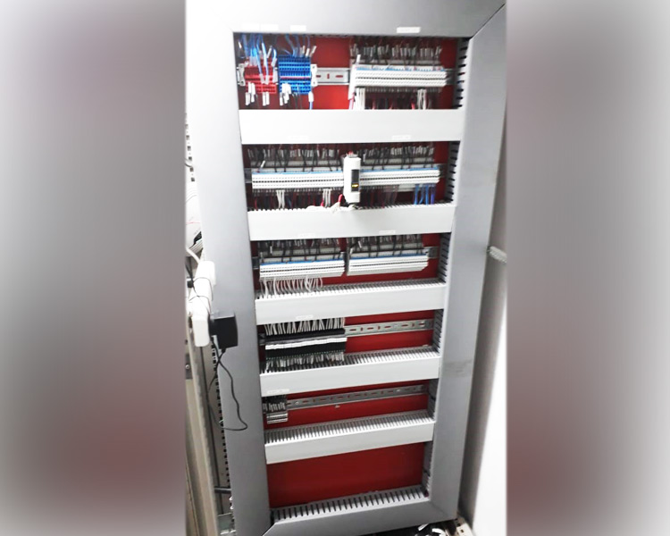
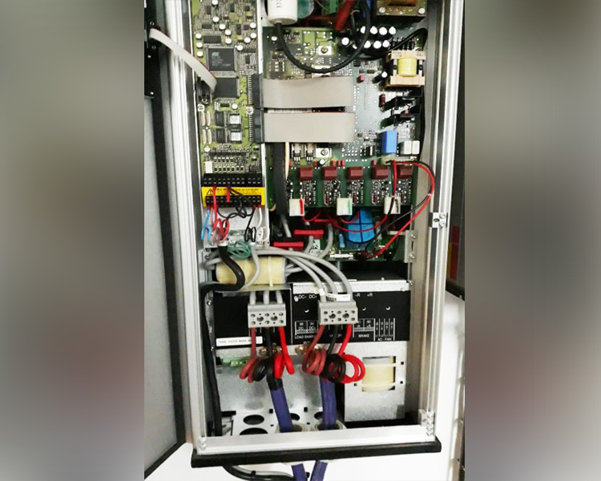
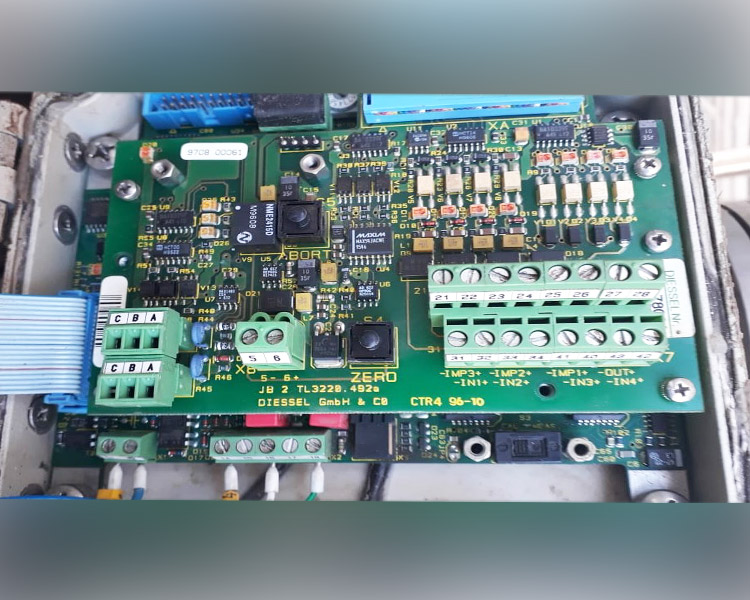
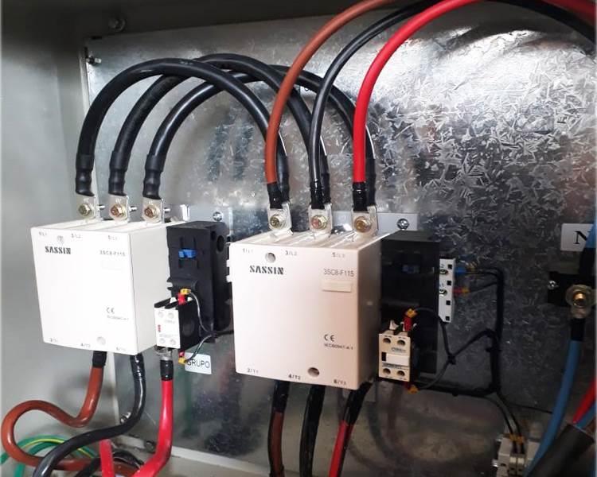

<!DOCTYPE html>
<html lang="es-ES">

<head>

	<!-- Basic Page Needs
	================================================== -->
	<meta charset="utf-8">
	<title>Electricidad Industrial JV</title>
	<meta name="description" content="">
	<meta name="keywords" content="">

	<!-- Mobile Specific Metas
	================================================== -->

	<meta http-equiv="X-UA-Compatible" content="IE=edge">
	<meta name="viewport" content="width=device-width, initial-scale=1.0, maximum-scale=1.0, user-scalable=0">

	<!-- CSS
	================================================== -->

	<!-- Bootstrap -->
	<link rel="stylesheet" href="css/bootstrap.min.css">
	<!-- Template styles-->
	<link rel="stylesheet" href="css/style.css">
	<!-- Responsive styles-->
	<link rel="stylesheet" href="css/responsive.css">
	<!-- FontAwesome -->
	<link rel="stylesheet" href="css/font-awesome.min.css">
	<!-- Animation -->
	<link rel="stylesheet" href="css/animate.css">
	<!-- Owl Carousel -->
	<link rel="stylesheet" href="css/owl.carousel.min.css">
	<link rel="stylesheet" href="css/owl.theme.default.min.css">
	<!-- Colorbox -->
	<link rel="stylesheet" href="css/colorbox.css">

	<!-- HTML5 shim, for IE6-8 support of HTML5 elements. All other JS at the end of file. -->
	<!--[if lt IE 9]>
      
      
    <![endif]-->

</head>

<body>

	

		

			

				

					

						<ul class="top-info">
							<li><i class="fa fa-map-marker">&nbsp;</i>
								
General Rodríguez, Buenos Aires

							</li>
						</ul>
					

					<!--/ Top info end -->

					

						<ul class="unstyled">
							<li>
								<a title="Facebook" href="https://facebbok.com/themefisher.com">
									<i class="fa fa-facebook"></i>
								</a>
								<a title="Twitter" href="https://twitter.com/themefisher.com">
									<i class="fa fa-twitter"></i>
								</a>
								<a title="Instagram" href="https://instagram.com/themefisher.com">
									<i class="fa fa-instagram"></i>
								</a>
								<a title="Linkdin" href="https://github.com/themefisher.com">
									<i class="fa fa-github"></i>
								</a>
							</li>
						</ul>
					

					<!--/ Top social end -->
				

				<!--/ Content row end -->
			

			<!--/ Container end -->
		

		<!--/ Topbar end -->

		<!-- Header start -->
		<header id="header" class="header-one">
			

				

					

						

							
						
<!-- logo end -->

						

							<ul class="top-info-box">
								<li>
									

										

											
Teléfono

											
+54 11-34985845

										

									

								</li>
								<li>
									

										

											
Email

											
office@Constra.com

										

									

								</li>
								<li class="header-get-a-quote">
									<a class="btn btn-primary" href="contact.html">Consulte</a>
								</li>
							</ul><!-- Ul end -->
						
<!-- header right end -->
					
<!-- logo area end -->

				
<!-- Row end -->
			
<!-- Container end -->

			<nav class="site-navigation navigation navdown">
				

					

						

							

								<button type="button" class="navbar-toggle" data-toggle="collapse" data-target=".navbar-collapse">
									Toggle navigation
									
									
									
								</button>

								

									<ul class="nav navbar-nav">
									<li><a href="contact.html">Inicio</a></li>
									<li><a href="#ts-features">Sobre mí</a></li>
									<li><a href="#ts-service-box">Servicios</a></li>
									<li><a href="contact.html">Trabajos</a></li>
									<li><a href="contact.html">Contacto</a></li>
									</ul>
									<!--/ Nav ul end -->
								

								<!--/ Collapse end -->

							
<!-- Site Navbar inner end -->

						

						<!--/ Col end -->
					

					<!--/ Row end -->
			</nav>
			<!--/ Navigation end -->
		</header>
		<!--/ Header end -->

		<!-- Carousel -->
		

			<!-- Indicators -->
			<ol class="carousel-indicators visible-lg visible-md">
				<li data-target="#main-slide" data-slide-to="0" class="active"></li>
				<li data-target="#main-slide" data-slide-to="1"></li>
				<li data-target="#main-slide" data-slide-to="2"></li>
			</ol>
			<!--/ Indicators end-->

			<!-- Carousel inner -->
			

				

					

						

							<h2 class="slide-title animated4">Más de 10 años de experiencia en </h2>
							<h3 class="slide-sub-title animated5">Electricidad Industrial</h3>
							

								<a href="services.html" class="slider btn btn-primary">Servicios</a>
								<a href="contact.html" class="slider btn btn-primary border">Contacto</a>
							

						

					

				

				<!--/ Carousel item 1 end -->

				

					

							

								<h2 class="slide-title animated4">Lograr un trabajo de excelencia es mi </h2>
								<h3 class="slide-sub-title animated5">Compromiso</h3>
								

									<a href="services.html" class="slider btn btn-primary">Servicios</a>
									<a href="contact.html" class="slider btn btn-primary border">Contacto</a>
								

							

						

				

				<!--/ Carousel item 2 end -->

				

					

						

							<h2 class="slide-title animated4">Lo que su empresa precisa</h2>
							<h3 class="slide-sub-title animated5">Equilibrio entre eficiencia   y costes</h3>
							

								<a href="services.html" class="slider btn btn-primary">Servicios</a>
								<a href="contact.html" class="slider btn btn-primary border">Contacto</a>
							

						

					

				

				<!--/ Carousel item 3 end -->

			
<!-- Carousel inner end-->

			<!-- Controllers -->
			<a class="left carousel-control" href="#main-slide" data-slide="prev">
				<i class="fa fa-angle-left"></i>
			</a>
			<a class="right carousel-control" href="#main-slide" data-slide="next">
				<i class="fa fa-angle-right"></i>
			</a>
		

		<!--/ Carousel end -->

		<section class="call-to-action-box no-padding">
			

				

					

						

							

								<h3 class="action-title">We understand your needs on construction</h3>
							

						
<!-- Col end -->
						

							

								<a class="btn btn-dark" href="#">Mensaje</a>
							

						
<!-- col end -->
					
<!-- row end -->
				
<!-- Action style box -->
			
<!-- Container end -->
		</section><!-- Action end -->

		<section id="ts-features" class="ts-features">
			

				

					

						

							<h2 class="into-title">Sobre mí</h2>
							<h3 class="into-sub-title">Jorge Walter Vega</h3>
							<h2 class="into-title">Electricista Industrial</h2>
							
Estudié Electrónica Industrial, Electricidad Industrial y Automatismo en PLC.
								Tengo 11 años de experiencia en instalaciones eléctricas industriales. Especialmente en industrias alimenticias y metalúrgicas.
								He trabajado en el diseño, instalación, puesta a punto y mantenimiento de muy diversos proyectos, en empresas grandes, medianas y chicas.
								Mi experiencia por lo tanto abarca una amplia gama de equipamientos y elementos afines.
								

						
<!-- Intro box end -->

						

						

							

								

									
										<i class="fa fa-trophy"></i>
									
									

										<h3 class="service-box-title">Enfocado en los resultados</h3>
									

								
<!-- Service 1 end -->
							
<!-- col end -->

							

								

									
										<i class="fa fa-sliders"></i>
									
									

										<h3 class="service-box-title">Experiencia a disposición de su empresa</h3>
									

								
<!-- Service 2 end -->
							
<!-- col end -->
						
<!-- Content row 1 end -->

						
							

								

									
										<i class="fa fa-thumbs-up"></i>
									
									

										<h3 class="service-box-title">En continua innovación </h3>
									

								
<!-- Service 1 end -->
							
<!-- col end -->

							

								

									
										<i class="fa fa-users"></i>
									
									

										<h3 class="service-box-title">Asesoramiento personalizado</h3>
									

								
<!-- Service 2 end -->
							
<!-- col end -->
						
					
<!-- Col end -->

					
<!-- Col end -->
				
<!-- Row end -->
			
<!-- Container end -->
		</section><!-- Feature are end -->
		
	<!----Sección servicios---------------------->
    <section id="main-container" class="main-container servicios">
		

			

			

				<h3 class="into-sub-title">Servicios</h3>
			

			

			

		      

						

						   
						

						

						   <h3 class="service-box-title"><a href="">Instalaciones industriales - Mantenimiento</a></h3>
						

					 
<!-- Service1 end -->
				  
<!-- Col 1 end -->
	  
				  

					 

						

						   
						

						

						   <h3 class="service-box-title">Montaje y tendido de cables para compresores y grupos electrógenos</a></h3>
						

					 
<!-- Service2 end -->
				  
<!-- Col 2 end -->
	  
				  

					 

						

						   
						

						

						   <h3 class="service-box-title"><a href="">Automatismo (PLC)- Instalación de sensores.</a></h3>
						

					 
<!-- Service3 end -->
				  
<!-- Col 3 end -->
				  

				  

					

					   

						  
					   

					   

						  <h3 class="service-box-title"><a href="">Montaje de bandejas Standard y sanitarias</a></h3>
					   

					
<!-- Service3 end -->
				 
<!-- Col 3 end -->
				 

					

					   

						  
					   

					   

						  <h3 class="service-box-title"><a href="">Electromecánica-Conexionado de motores</a></h3>
					   

					
<!-- Service3 end -->
				 
<!-- Col 3 end -->
				 

					

					   

						  
					   

					   

						  <h3 class="service-box-title"><a href="">Tendido de cables</a></h3>
					   

					
<!-- Service3 end -->
				 
<!-- Col 3 end -->
				 

				 

					

					   

						  
					   

					   

						  <h3 class="service-box-title"><a href="">Montaje de tableros</a></h3>
					   

					
<!-- Service3 end -->
				 
<!-- Col 3 end -->
				 

					

					   

						  
					   

					   

						  <h3 class="service-box-title"><a href="">Armado de placas de tableros</a></h3>
					   

					
<!-- Service3 end -->
				 
<!-- Col 3 end -->
				 

					

					   

						  
					   

					   

						  <h3 class="service-box-title"><a href="">Planos eléctricos</a></h3>
					   

					
<!-- Service3 end -->
				 
<!-- Col 3 end -->
				
<!-- Main row end -->
			
<!-- Conatiner end -->
		 </section><!-- Main container end -->
	<!-----Galería---------->
	<section id="main-container" class="main-container">
		

		   

			  

				

					

					   

						  <a class="gallery-popup" href="images/caja-electricidad.jpg">
							 
							 <i class="fa fa-plus"></i>
						  </a>
					   

					
<!-- Isotope item 1 end -->
					

						

						   <a class="gallery-popup" href="images/cables-eletricidad.jpg">
							  
							  <i class="fa fa-plus"></i>
						   </a>
						

					 
<!-- Isotope item 2 end -->
					 

						

						   <a class="gallery-popup" href="images/tablero-industrial.jpg">
							  
							  <i class="fa fa-plus"></i>
						   </a>
						

					 
<!-- Isotope item 3 end -->
					 

						

						   <a class="gallery-popup" href="images/tablero-electridad-industria.jpg">
							  
							  <i class="fa fa-plus"></i>
						   </a>
						

					 
<!-- Isotope item 4 end -->
	  
					 

						

						   <a class="gallery-popup" href="images/placa-electronica.jpg">
							  
							  <i class="fa fa-plus"></i>
						   </a>
						

					 
<!-- Isotope item 5 end -->
	  
					 

						

						   <a class="gallery-popup" href="images/electricidad-industrial.jpg">
							  
							  <i class="fa fa-plus"></i>
						   </a>
						

					 
<!-- Isotope item 6 end -->
				  
<!-- Isotop end -->
	  
			
<!-- Conatiner end -->
		 </section><!-- Main container end -->

<!------Contacto--------------->
		 <section id="main-container" class="main-container">
			

	  
			   

				  <h2 class="section-title">Reaching our Office</h2>
				  <h3 class="section-sub-title">Find Our Location</h3>
			   
<!--/ Title row end -->
	  
			   

				  

					 

						
						   <i class="fa fa-map-marker"></i>
						
						

						   <h4>Visit Our Office</h4>
						   
9051 Constra Incorporate, USA

					   

					 

				  
<!-- Col 1 end -->
	  
				  

					 

						
						   <i class="fa fa-envelope"></i>
						
						

						   <h4>Email Us</h4>
						   
office@Constra.com

					   

					 

				  
<!-- Col 2 end -->
	  
				  

					 

						
						   <i class="fa fa-phone-square"></i>
						
						

						   <h4>Call Us</h4>
						   
(+9) 847-291-4353

					   

					 

				  
<!-- Col 3 end -->
	  
			   
<!-- 1st row end -->
	  
			   

			   

               
				<h3 class="column-title">We love to hear</h3>
 
				<form id="contact-form" action="contact-form.php" method="post" role="form">
				   

				   

					  

						 

							<label>Name</label>
						 <input class="form-control form-control-name" name="name" id="name" placeholder="" type="text" required>
						 

					  

					  

						 

							<label>Email</label>
							<input class="form-control form-control-email" name="email" id="email" 
							placeholder="" type="email" required>
						 

					  

				   

				   

					  <label>Message</label>
					  <textarea class="form-control form-control-message" name="message" id="message" placeholder="" rows="10" required></textarea>
				   

				   
 
					  <button class="btn btn-primary solid blank" type="submit">Send Message</button> 
				   

				</form>
			 

		  
		  
<!-- Content row -->
	   
<!-- Conatiner end -->
	</section><!-- Main container end -->
	 
	  
	
		<footer id="footer" class="footer bg-overlay">
			

				

					

						

							<h3 class="widget-title">About Us</h3>
							
							
Lorem ipsum dolor sit amet, consectetur adipisicing elit, sed do eiusmod tempor inci done idunt ut
								labore et dolore magna aliqua.

							

								<ul>
									<li><a href="https://facebook.com/themefisher"><i class="fa fa-facebook"></i></a></li>
									<li><a href="https://twitter.com/themefisher"><i class="fa fa-twitter"></i></a></li>
									<li><a href="https://instagram.com/themefisher"><i class="fa fa-instagram"></i></a></li>
									<li><a href="https://github.com/themefisher"><i class="fa fa-github"></i></a></li>
								</ul>
							
<!-- Footer social end -->
						
<!-- Col end -->

						

							<h3 class="widget-title">Working Hours</h3>
							

								We work 7 days a week, every day excluding major holidays. Contact us if you have an emergency, with our
								Hotline and Contact form.
								   Monday - Friday: 10:00 - 16:00 
								  Saturday: 12:00 - 15:00
								  Sunday and holidays: 09:00 - 12:00
							

						
<!-- Col end -->

						

							<h3 class="widget-title">Services</h3>
							<ul class="list-arrow">
								<li><a href="service-single.html">Pre-Construction</a></li>
								<li><a href="service-single.html">General Contracting</a></li>
								<li><a href="service-single.html">Construction Management</a></li>
								<li><a href="service-single.html">Design and Build</a></li>
								<li><a href="service-single.html">Self-Perform Construction</a></li>
							</ul>
						
<!-- Col end -->

					
<!-- Row end -->
				
<!-- Container end -->
			
<!-- Footer main end -->

			

				

					

						

							

								Copyright © 2019 a theme by <a href="https://themefisher.com">themefisher.com</a>
							

						

						

							

								<ul class="nav unstyled">
									<li><a href="about.html">About</a></li>
									<li><a href="team.html">Our people</a></li>
									<li><a href="faq.html">Faq</a></li>
									<li><a href="news-left-sidebar.html">Blog</a></li>
									<li><a href="pricing.html">Pricing</a></li>
								</ul>
							

						

					
<!-- Row end -->

					

						<button class="btn btn-primary" title="Back to Top">
							<i class="fa fa-angle-double-up"></i>
						</button>
					

				
<!-- Container end -->
			
<!-- Copyright end -->

		</footer><!-- Footer end -->

		<!-- Javascript Files
	================================================== -->

		<!-- initialize jQuery Library -->
		
		<!-- Bootstrap jQuery -->
		
		<!-- Owl Carousel -->
		
		<!-- Color box -->
		
		<!-- Isotope -->
		
		

    <!-- Google Map API Key-->
		
		<!-- Google Map Plugin-->
		
 
	 <!-- Template custom -->
	 

	
<!-- Body inner end -->
</body>

</html>